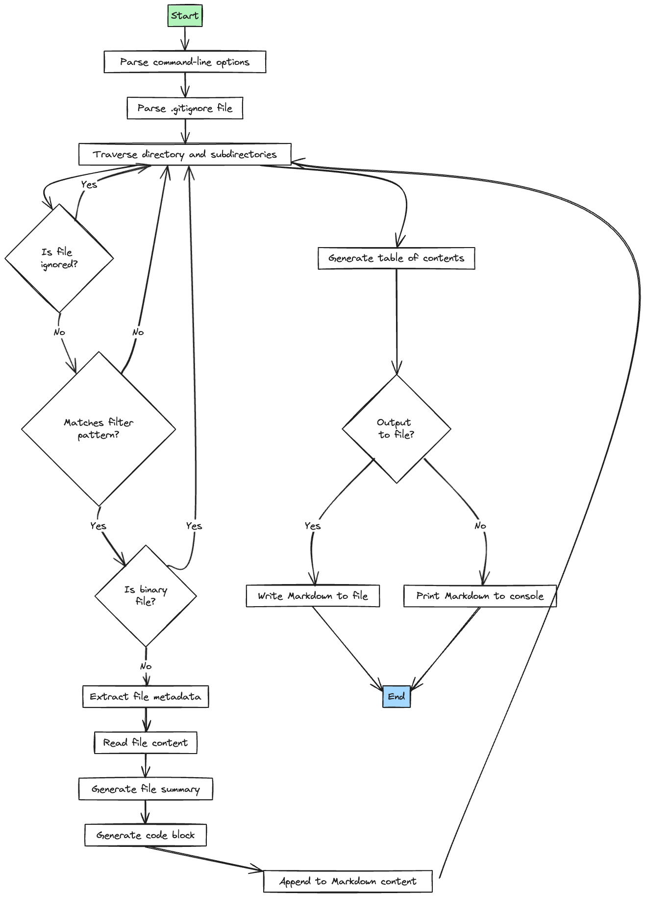

# Code2Prompt

Code2Prompt is a powerful command-line tool that simplifies the process of providing context to Large Language Models (LLMs) by generating a comprehensive Markdown file containing the content of your codebase. 

With Code2Prompt, you can easily create a well-structured and informative document that serves as a valuable resource for feeding questions to LLMs, enabling them to better understand and assist with your code-related queries.


## Features

- Automatically traverses a directory and its subdirectories to include all relevant files
- Supports filtering files based on patterns (e.g., "*.py" to include only Python files)
- Respects .gitignore files to exclude unwanted files and directories
- Generates a table of contents with links to each file section
- Provides file metadata such as extension, size, creation time, and modification time
- Optionally strips comments from code files to focus on the core code
- Includes the actual code content of each file in fenced code blocks
- Handles binary files and files with encoding issues gracefully

## How It Works

The following diagram illustrates the high-level workflow of Code2Prompt:




1. The tool starts by parsing the command-line options provided by the user.
2. It then parses the .gitignore file (if specified) to obtain a set of patterns for excluding files and directories.
3. The tool traverses the specified directory and its subdirectories, processing each file encountered.
4. For each file, it checks if the file is ignored based on the .gitignore patterns. If ignored, it skips the file and moves to the next one.
5. If the file is not ignored, it checks if the file matches the filter pattern (if provided). If the file doesn't match the filter, it skips the file and moves to the next one.
6. If the file matches the filter pattern, it checks if the file is a binary file. If it is, it skips the file and moves to the next one.
7. If the file is not a binary file, the tool extracts the file metadata (extension, size, creation time, modification time).
8. It then reads the file content and generates a file summary and code block.
9. The file summary, code block, and metadata are appended to the Markdown content.
10. Steps 4-9 are repeated for each file in the directory and its subdirectories.
11. After processing all files, the tool generates a table of contents based on the file paths.
12. If an output file is specified, the generated Markdown content is written to the file. Otherwise, it is printed to the console.
13. The tool ends its execution.

## Installation

There are two ways to install Code2Prompt:

### Using Poetry

Code2Prompt is built using Poetry, a dependency management and packaging tool for Python. To install Code2Prompt using Poetry, follow these steps:

1. Make sure you have Poetry installed. If you don't have it installed, you can install it by running:
   ```
   curl -sSL https://install.python-poetry.org | python3 -
   ```

2. Clone the Code2Prompt repository:
   ```
   git clone https://github.com/raphael.mansuy/code2prompt.git
   ```

3. Navigate to the project directory:
   ```
   cd code2prompt
   ```

4. Install the dependencies using Poetry:
   ```
   poetry install
   ```

### Using pipx

Alternatively, you can install Code2Prompt using pipx, a tool for installing and running Python applications in isolated environments. To install Code2Prompt using pipx, follow these steps:

1. Make sure you have pipx installed. If you don't have it installed, you can install it by running:
   ```
   python3 -m pip install --user pipx
   python3 -m pipx ensurepath
   ```

2. Install Code2Prompt using pipx:
   ```
   pipx install git+https://github.com/raphael.mansuy/code2prompt.git
   ```

   This command will clone the Code2Prompt repository and install it in an isolated environment managed by pipx.

3. After installation, you can run Code2Prompt using the `code2prompt` command:
   ```
   code2prompt --path /path/to/your/codebase --output output.md
   ```

Using pipx provides a convenient way to install and run Code2Prompt without affecting your system-wide Python installation.

## Usage

To generate a Markdown file with the content of your codebase, use the following command:

```
code2prompt --path /path/to/your/codebase --output output.md
```

- `--path` (required): Path to the directory containing your codebase.
- `--output` (optional): Name of the output Markdown file. If not provided, the output will be displayed in the console.
- `--gitignore` (optional): Path to a custom .gitignore file. If not provided, the tool will look for a .gitignore file in the specified directory.
- `--filter` (optional): Filter pattern to include specific files (e.g., "*.py" to include only Python files).
- `--suppress-comments` (optional): Strip comments from the code files. If not provided, comments will be included.

### Examples

1. Generate a Markdown file for a Python project:
   ```
   code2prompt --path /path/to/your/python/project --output python_project.md --filter "*.py"
   ```

2. Generate a Markdown file for a web development project:
   ```
   code2prompt --path /path/to/your/web/project --output web_project.md --filter "*.js,*.html,*.css"
   ```

3. Generate a Markdown file for a project with a custom .gitignore file:
   ```
   code2prompt --path /path/to/your/project --output project.md --gitignore /path/to/custom/.gitignore
   ```

4. Generate a Markdown file with comments stripped from code files:
   ```
   code2prompt --path /path/to/your/project --output project.md --suppress-comments
   ```

## Build

To build a distributable package of Code2Prompt using Poetry, follow these steps:

1. Make sure you are in the project directory.

2. Run the following command to build the package:
   ```
   poetry build
   ```

   This command will create a distributable package in the `dist` directory.

3. You can then install the package using pip:
   ```
   pip install dist/code2prompt-<version>.tar.gz
   ```

   Replace `<version>` with the actual version number of the package.

## License

Code2Prompt is released under the MIT License. See [LICENSE](LICENSE.md) for more information.

## Contributing

Contributions are welcome! If you find any issues or have suggestions for improvements, please open an issue or submit a pull request on the [GitHub repository](https://github.com/raphaelmansuy/code2prompt).

## Acknowledgements

Code2Prompt was inspired by the need to provide better context to LLMs when asking code-related questions. We would like to thank the open-source community for their valuable contributions and the developers of the libraries used in this project.

If you have any questions or need further assistance, please don't hesitate to reach out. Happy coding!

Made with ❤️ by Raphël MANSUY.
